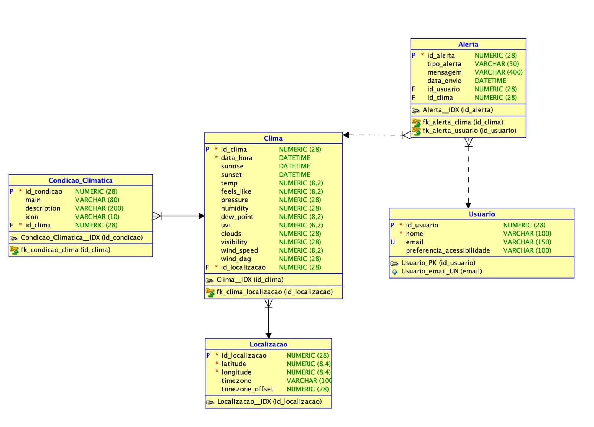

# 🌦️ Easy Weather

## 👥 Integrantes

| Nome Completo | RM | Função / Responsabilidade |
|----------------|----|---------------------------|
| **Alex Ribeiro Maia** | RM557356 | Desenvolvedor Full-Stack — responsável pelo desenvolvimento da **API em Java (Spring Boot)** e do **aplicativo mobile em React Native** |
| **Nathalia de Oliveira Santos** | RM560306 | Responsável pela **construção do banco de dados relacional (Oracle)** e pela realização de **testes de QA, Compliance e Test Assurance** |
| **Felipe Olecsiuc Damasceno** | RM559433 | **DevOps & Arquiteto de Solução** — responsável pela **documentação da máquina virtual (Docker)**, **design da arquitetura do ambiente**, desenvolvimento **.NET (domínio, aplicação, infraestrutura, repositórios concretos, integrações externas e migrações)**, além de **IoT**, **pitch da solução** e **documentação técnica** |

---

## 💡 Sobre o Projeto

**Easy Weather** é uma aplicação **de acessibilidade e inclusão digital** voltada para **pessoas com deficiência**, permitindo uma **interação intuitiva e acessível com informações climáticas em tempo real**.

A solução combina **tecnologia mobile**, **IoT**, e **serviços Oracle** para oferecer previsões personalizadas, alertas meteorológicos e uma interface assistiva otimizada para **usuários com deficiência visual e auditiva**.

---

## 🧩 Arquitetura da Solução

A aplicação é composta por três principais camadas tecnológicas:

1. **Backend (API Java - Spring Boot)**
    - Responsável por prover os dados de previsão e alertas climáticos.
    - Conecta-se ao banco de dados Oracle.
    - Implementa autenticação e rotas REST.

2. **Infraestrutura e DevOps (.NET, Docker, Oracle Cloud)**
    - Gerenciada via containers Docker.
    - Automação de deploy e CI/CD.
    - Documentação e mapeamento da arquitetura do ambiente.

---

## ⚙️ Instruções para Rodar a Aplicação (Spring Boot)

### 🖥️ Requisitos
- **Java 17+**
- **Maven 3.9+**
- **Banco de dados Oracle**
- **IDE recomendada:** IntelliJ IDEA ou Eclipse

### 🚀 Passo a Passo

1. **Clone o repositório:**
   ```bash
   git clone https://github.com/seuusuario/easy-weather.git
   
2. **Acesse o diretório do projeto:**
   ```bash
   cd easy-weather/backend
   
3. **Configure o arquivo application.properties:**
   ```bash
    spring.datasource.url=jdbc:oracle:thin:@//<host>:<port>/<service_name>
    spring.datasource.username=<seu_usuario>
    spring.datasource.password=<sua_senha>
    spring.jpa.hibernate.ddl-auto=update
    spring.jpa.show-sql=true

4. **Compile e execute a aplicação:**
   ```bash
   mvn spring-boot:run


**🗂️ Diagramas de classes do Projeto**




## 🧠 Tecnologias Utilizadas

- **Java 17 / Spring Boot**
- **Oracle Database**
- **.NET Core**
- **Docker**
- **Oracle Cloud**
- **IoT Devices**
- **GitHub / Git**


## 💬 Contato

- **Alex Ribeiro Maia** — [LinkedIn](https://www.linkedin.com/in/alex-maia-a16681291/)
- **Nathalia de Oliveira Santos** — [LinkedIn](https://www.linkedin.com/in/nat%C3%A1lia-de-oliveira-santos/)
- **Felipe Olecsiuc Damasceno** — [LinkedIn](https://www.linkedin.com/in/felipe-olecsiuc-damasceno-034b82174/)

